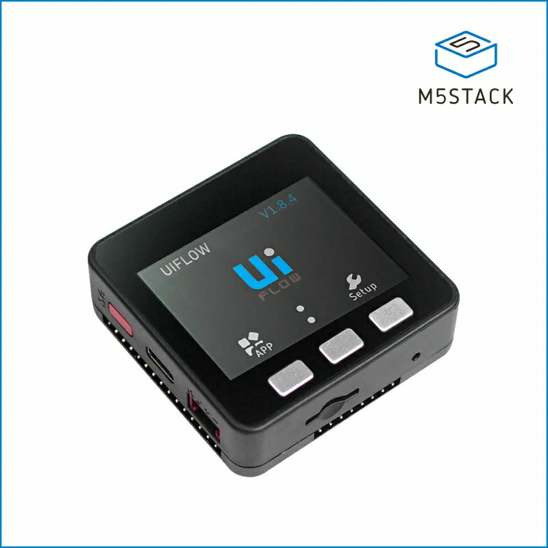
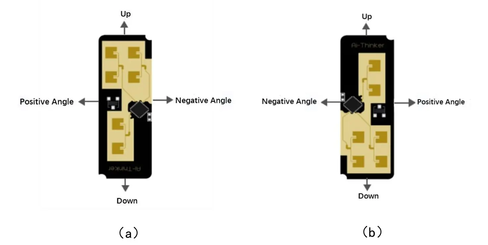
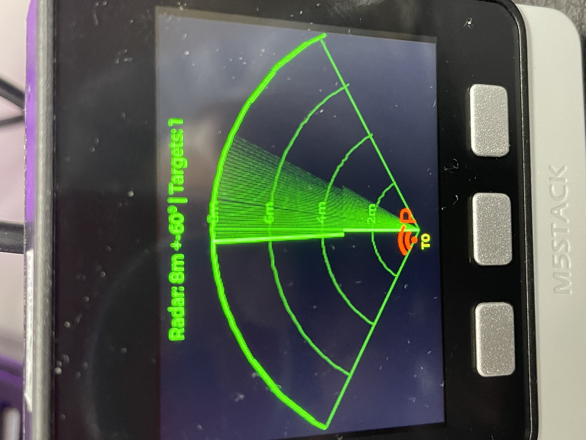
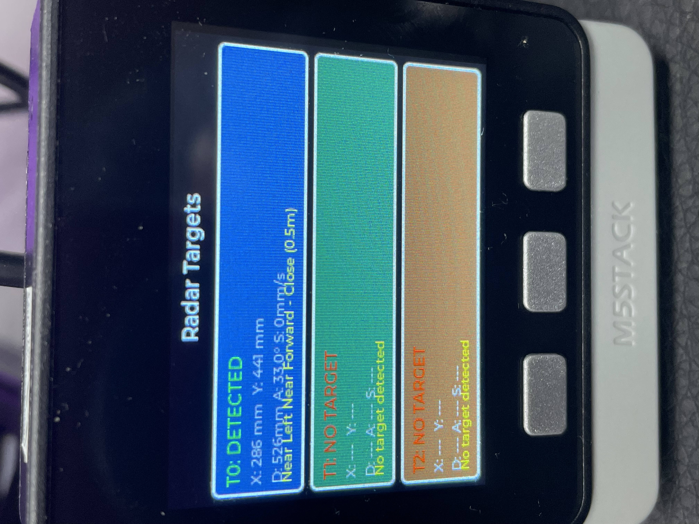

# HumanRadar

## Overview

<table>
<tr>
  <td width="50" valign="top">
    
  </td>
  <td valign="top">
Tracks upto three people (or live entities), displaying X/Y position, speed, and distance on a textual or radar like display.
  </td>
</tr>
</table>

## Images
<table>
<tr>
  <td width="300" valign="top">
    
  </td>
  <td valign="center">
**M5Stack Core Basic v2.7**  A cost-effective IoT entry-level main controller. It uses the Espressif ESP32 chip, equipped with 2 low-power Xtensa® 32-bit LX6 microprocessors, with a main frequency of up to 240 MHz. It has onboard 16 MB FLASH memory, integrated with a 2.0-inch full-color high-definition IPS display panel, speaker, TFCard slot, and other peripherals. The full-cover casing ensures the stability of circuit operation even in complex industrial application scenarios. The internal bus provides multiple common interface resources (ADC/DAC/I2C/UART/SPI, etc.), with 15 x IO leads on the bottom bus, offering strong expandability. It is suitable for various product prototype development, industrial control, and smart building application scenarios.  </td>
</tr>
<tr>
  <td width="300" valign="top">
    
  </td>
  <td valign="center">
Orientation options of RD-03D sensor.
  </td>
</tr>
<tr>
  <td width="300" valign="top">
    
  </td>
  <td valign="center">
Radar display mapping position of targets.  Toggle button one to switch.
  </td>
</tr>
<tr>
  <td width="300" valign="top">
    
  </td>
  <td valign="center">
Detailed display describing target attributes.  Toggle button one to switch.
  </td>
</tr>
</table>

## Devices
- [M5Stack Core V2.7](https://docs.m5stack.com/en/core/basic_v2.7)
- [RD-03D mmWave](https://a.co/d/2Vktl3s)

## Configuration
- LVGL V9.4
- ESP-IDF V5.52
- skoona/humanRadarRD_03D  {component}
- espressif/BSP  {M5StackCore SDK}

## Performance Considerations

- Call `radar_sensor_update()` regularly (recommended: 50-100ms intervals)
- The retention system processes data even when no new sensor data arrives
- UART buffer size is optimized for the RD-03D frame format
- Position descriptions are updated automatically when target data changes

## References

- **AI-Thinker RD-03D Datasheet**: [Official Technical Documentation](https://docs.ai-thinker.com/_media/rd-03d_specification.pdf)
- **English Quick Start Guide**: [RD-03D Quick Start Guide](components/humanRadarRD_03D/docs/Rd-03D_V2quick_start_guide-en.pdf)

## License

This component is provided under the MIT License. See LICENSE file for details.

## Contributing

Contributions are welcome! Please submit pull requests or issues through the GitHub repository.

## Author
- [skoona](https://github.com/skoona)
  